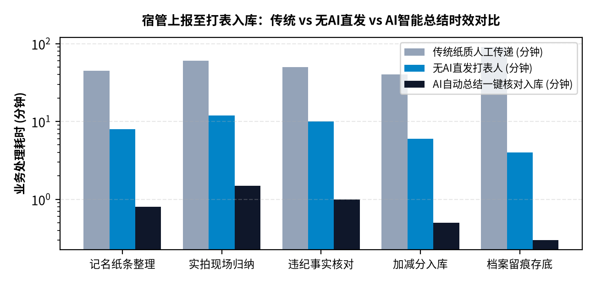
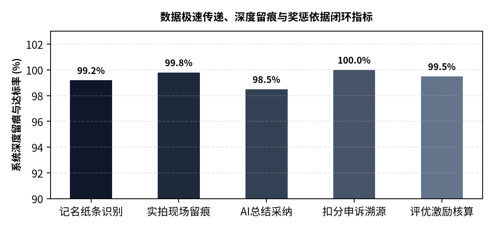

# 学管会综合管理系统 · 业务功能与深度留痕实操指南

**CAMPUS RESIDENCE MANAGEMENT SYSTEM · OPERATIONAL MANUAL**

聚焦数据极速传递、实拍与名单双轨归纳、AI快速总结核对与真实奖惩激励

- 编写背景：，聚焦一线数据真实流转与高效提炼
- 核心定位：宿管双轨上报 · AI智能提炼核对 · 技术副部长一键加减分 · 终生深度留痕
- 适用角色：各楼栋宿管 · 纪检巡查干事 · 技术部副部长 · 各部部长 · 评优导出人员
- 最新修订：2026 年秋季生产运行版

---

## 一、 这个系统的实际解决重点是什么？（立足校园管理真实情况）

由于学校内严格禁止学生携带智能手机及私拉乱用电器，因此系统在设计上彻底摒弃了不切实际的'学生端繁重打卡或个人复杂操作'，而是将核心战力聚焦于：【宿舍一线真实数据的极速传递】、【纸质名单条子与实拍照片的自动化提炼归纳】、【有无AI均可平稳流转的核对机制】以及【全校学生德育表现与干事考评的深度留痕】。

> **【业务核心定位】**
>
> 系统运作四大真实抓手：
>
> 1. 极速数据传递：宿管老师在值班台快速上传现场照片或手写记名纸条，系统秒级送达打表大盘，彻底告别以前'写在便签条上四处找人传递、隔天就丢'的漏洞。
> 2. 双轨数据归纳（实拍照片 vs 记名纸条）：宿管既可以拍违规现场实拍，也可以直接拍手写的记名纸条；有AI时直接识别转成文本，无AI时原汁原味直发打表人。
> 3. 技术副部长核对打表与一键加减分：副部长在工作台查看AI总结报告与原图核对，核实无误一键点击'确认转入'，扣分直接写入全校学生档案与历史数据，无法抵赖。
> 4. 真实奖惩与激励机制：不仅记录扣分，更完整保留干事上工加分流水，为期末评选'文明标兵寝室'与干事评优奖励提供最硬核的留痕铁证！

## 二、 所有人都能用的"公共大厅"（无需登录的公开窗口）

在无登录的初始大厅中，整齐摆放着针对全校日常业务的公开入口：

| 功能模块 | 在哪里找到 | 实际业务用途与解决的痛点 |
|----|----|----|
| **招新纳新一键申报** | 首页顶部【加入学管会】 | 招新期间同学只需在班级电脑上填写班级、姓名、手机号和意向部门（纪检/宣传/组织），省去人工收发表格。 |
| **素养常识在线测评** | 首页顶部【进入素养测评】 | 考察宿舍防火防电安全常识与纪检规范，系统自动批改出分，作为干事选拔的重要客观依据。 |
| **宿管手机三要素直登** | 首页顶部【宿管手机直登】 | 宿管阿姨看这里！输入手机号、阿姨姓名和负责楼栋，秒级核验进入，不用死记复杂密码。 |
| **统一工作台登入口** | 首页右上角【登录工作台】 | 宿管老师、打表副部长、各部部长及导出人员由此登录，进入各自专属的数据处理页面。 |

**登录页长什么样**（2026-10-01 起）：点任一登录入口后是**整屏浅色登录页**——左侧是系统介绍（干什么、留痕与授权口径），右侧是登录区，两枚胶囊切换【账号密码登录】与【宿管手机认证】。已开启登录二次验证的账号，口令输对后会多出一栏【动态验证码】，填验证器里的 6 位数字才能进；手机上看不到左侧介绍，直接就是登录区。

图 2-1 宿管上报至打表入库：传统方式 vs 无AI直发 vs AI智能总结时效对比

## 三、 宿管老师一线采集：现场实拍与记名纸条双轨上报

宿管老师常驻各楼栋，是园区数据的第一采集源头。系统为宿管老师量身定制了最直观的操作台（2026-10-01 起按值班台排版），核心突出【时段提醒】与【双轨上报留痕】。

### 3.1 到点自动提醒交什么（动态时段任务卡片）

宿管阿姨一打开工作台，正中间那张卡的上半就是本时段提醒：当前时段名、时间区间与剩余分钟、必须提交的材料、以及"今日已交几张 / 还差几张"的状态，下半紧接着就是填写与拍照的地方——**看到要交什么，手底下就是交的动作**。电脑上是三栏：中间这张主卡，左栏是今日各时段班次，右栏是本楼栋历史留痕；手机上自动叠成一列，主卡仍在最上面。

| 巡查时段 | 当前规范提交材料与要求 | 一线留痕关键点 |
|----|----|----|
| **早间 06:30 - 08:30 (离寝通风断电)** | 走廊窗户开启通风照、宿舍空室熄灯断电单、早出勤干事佩戴袖标核查 | 检查公共区域与走廊照明关停，拍一张留痕照片即可。 |
| **午间 11:40 - 13:50 (安全隐患抽查)** | 各寝室内务评定单、午间到岗干事照 | 重点排查寝室违章插座或用电隐患，拍照或手写记名条上传。 |
| **晚间 19:00 - 22:30 (熄灯巡查与查寝)** | 晚归未归核对表、纪检干事到岗复核照片 | 纪检部干事巡查后当面汇报宿管，宿管当场拍照上传系统。 |
| **深夜 22:30 - 06:30 (门禁反锁与巡更)** | 大门安全闭锁反锁照片、门禁晚归学生姓名登记条、夜间安防日志 | 门锁上后拍照上传存证，严格登记晚归学生班级姓名备查。 |

### 3.2 拍照双轨模式：【现场违规实拍】与【记名纸条拍照】

阿姨只要掏出手机，选择寝室号（如 302），即可选择两种上报形式：

1. 现场实拍照片：如现场发现私拉电线或杂乱，拍下现场实物实景，作为最硬核的不可抵赖依据。

2. 记名纸条拍照：纪检干事查完寝在便签纸上手写的名单条子，阿姨不用辛苦打字，直接拍一张纸条照片上传，系统自动提取文字储存。

3. 历史照片瀑布流：阿姨随时可在工作台翻看本栋宿舍过去上传的所有照片与说明，事后查证一清二楚。

> **【现场核查与数据源头管理】**
>
> 真实运作机制：
>
> 纪检部同学查完寝室后，当面或在后台向楼栋宿管老师汇报。纪检部同学自己不能打表，由宿管老师拍照采集上传，保证源头证据确凿，防止人情瞒报！

## 四、 技术部副部长专属打表大盘：数据快速总结与核对入库

根据管理规定，普通部员和纪检部员都不参与打表。全校所有宿舍违纪扣分与数据总结，严格集中在【技术部副部长】和技术维护人员的专属工作台中。

### 4.1 宿管上午上报数据实时监控墙

技术副部长登录后，左侧点击【宿管上午数据打表汇总】，立刻看到一面完整的上报监控卡片墙：

- 卡片内容全景呈现：清楚标明哪一栋、哪一层（如 1号楼 3F 302室）、负责宿管阿姨姓名、提交时间、现场原图或记名纸条大图、以及系统提炼的事实说明。

- 状态区分清晰：绿色表示'待核准打表'，灰色表示'已录入打表'，绝不发生重复扣分。

### 4.2 双模态智能处理：【有 AI 快速总结】与【无 AI 直发打表】

系统在数据流转上做到了极致的可靠性与容灾备份：

- 情况一：启用 AI 辅助状态（极速总结提炼）\
  系统大模型会自动将宿管拍的记名纸条或现场照片，快速识别转换为标准文本格式（包含：违纪类别、严重等级、扣分分值建议及事实总结）。副部长看一眼 AI 总结报告，核对无误后点击【转入打表扣分】，系统自动填充表单，副部长只需选定学生班级姓名即可一键扣分，耗时不到 30 秒！

- 情况二：无 AI 辅助状态（原图直发直传打表人）\
  在网络受限或外部 AI 接口未开启时，系统完全不卡顿！宿管提交的现场实拍与记名纸条图片将【直接毫秒级直发推送给打表副部长】。副部长直接看原图手写名单，在表单中录入扣分，确保数据传递不断档！

### 4.3 一键核对转入加减分与写入历史档案

副部长核对成功后，点击提交，扣分记录正式落盘并【永久写入全校历史数据库与学生德育档案】。支持按楼层、寝室、名字、班级四维任意搜索，随时导出 CSV 打表单，作为期末班级评比的铁证！

图 4-1 宿管上报至打表：极速数据传递、深度留痕与奖惩闭环率统计

## 五、 学管会部长管理工作台：管人升职、智能排表与奖惩激励制度

部长是部门各项事务的掌舵人。系统为部长提供了高效的调度工具，不仅极速减负，更构筑起严密的奖惩考评激励机制。

### 5.1 管理部员与任命副部长

- 查看本部干事全貌：部长点击【管理部员 / 任命副部长】，查阅本部所有干事的姓名、电话、累计查寝班次、考核总积分与当前职务。

- 一键升职副部长：发现干事履职优秀？点击【升职为副部长】即可直接任命！

- 打表特权派生：如果是技术部部长任命了技术副部长，系统自动为该副部长开通专有的打表分栏，派发全校打表权。

### 5.2 奖惩制度与全员积分激励体系（留痕存底）

干事工作的积极性离不开公正透明的激励制度。系统构建了多维考评模型：

- 出勤加分激励：干事准时完成一次排班查寝，系统自动记入 +5 积分；替请假同学顶岗值班，自动额外奖励 +3 积分。

- 违规缺勤惩罚：无故缺勤或旷工的干事，大盘自动红牌警告并扣除对应积分，直接影响学期评优。

- 标兵榜样推送：每周根据积分流水，系统自动评定出'最优上工标兵'与'最高积分模范'，并在全员看板公示表扬。

- 部长灵活调分：遇重大活动保障表现优异，部长可点击【调分】，填写理由即时奖励加分，所有变动终生留痕。

### 5.3 AI 对话智能排班与本周三色履职大盘

- 对话排班：部长在工作台直接给 AI 发消息（如'下周高二期中考避开高二，安排1栋和3栋'），AI 自动匹配在册真实干事排好表格，点击【发布排班】即刻推送到全校日程。

- 三色大盘：绿（已到岗履职）、蓝（待值班备勤）、红（旷工缺勤），一眼看清本周出勤纪律。

- 请假审批与智能替补：部员因故请假，部长点击批准，系统算法自动从干事里挑出最近出勤最少、手头无任务的部员替补，并自动给替补部员加分，无需部长私下协调。

### 5.4 部门福利自主设置

福利属于激励制度的一部分。部长可自主为本部干事设置积分换奖品或 AI 辅导额度，谁定价谁负责，调动干事工作积极性。

## 六、 宣传部、播音组与干事基础服务

虽然校内禁止学生随意使用手机和电器，但在办公室或班级公用设备上，各部门干事仍享有便捷的辅助功能。

### 6.1 宣传部插画灵感工坊与播音组新闻筛选

- 宣传部插画素材工坊：办黑板报、绘制展板缺乏灵感？这里对接第三方随机图床「栗次元」（t.alcy.cc），按 **PC 横图、移动竖图、萌版横图、萌版竖图、风景横图、白底横图、头像方图、原神横图、原神竖图、七濑胡桃、小狐狸** 共 11 个分类，每次随机取 6 张，只用于部内找构图与配色灵感。图片由服务器取回并缓存在本机后再从本站提供给浏览器，值班机不直连第三方图床。⚠️ 两点要说清楚：上游**不做内容分级**，随机结果不可控，因此本页面只对登录后的学管会成员开放；界面上早期的"东方水墨""赛博科技 HUD"等标签是凭空起的名字、上游并无该分类，现已按上游真实分类重列，随机动图（mp4）也已排除。页面顶部常驻**「使用须知与免责声明」四条**：图片由上游当场返回、本系统不挑选不审核不长期保存；著作权归原作者，**不得原图直接贴到海报、展板、招新推文等对外物料**，引用需自行确认出处与授权；本页仅登录成员可见，禁止下载转发传播不适内容；**用于校园公开展示前须由宣传部部长人工审核**，未审核发布的问题由发布人负责。

- 播音组新闻筛选与宣讲稿一键生成：播音干事输入'安全'、'文明'即可拉取校园时讯；点击'一键生成广播稿'，系统自动汇总本周模范寝室名单与优秀干事事迹，写成标准广播稿，方便早晚广播宣读。
- 今日新闻早知道（AI 自动讲稿）：播音组面板上方的「生成今日讲稿」按钮，一次取回**世界局势 / 国内大事 / 科技新闻**三路当日新闻与本地实况天气，按固定格式出稿——「世界新闻早知道，今日新闻我来报。学管会带你了解今日新闻。1.…2.…3.…。下面是天气预报：今日天气…温度…」。用之前需技术组在【技术组控制台 → 播音讲稿数据源】填好新闻检索密钥、打开开关并设置天气城市；**天气一天只向上游取一次**，第二次直接读当天缓存。稿子只显示与复制、不写入新闻库；讲稿下方列出本次引用的新闻出处，**播出前请逐条人工核对**——系统不校验新闻真伪，也不替播音员负责。

### 6.2 普通干事个人台账与独立请假申报

- 个人履职台账：在电脑端登录后，干事可随时查看自己的总积分、累计查寝班次、以及每一次加减分的明细记录，清楚明了。

- 独立极速请假：遇到课程冲突，在线提报请假单并勾选【智能人员替补】，免去自己私下求人顶岗的麻烦。

- 部门福利兑换：使用日常值班累积的考勤积分，兑换部长上架的奖励或大模型使用额度。

## 七、 全校学生宿位名单管理与查寝防冒名联动

教务处给的名册往往格式杂乱。系统构建了极度聪明的名册中心：

- 杂乱文本直接粘：不管是从 Excel 还是记事本复制的杂乱名单（如'1号楼 301 李华 高一(1)班 1号床'），直接粘贴，系统自动识别出楼栋、寝室、学生姓名与班级，高一到高三一键入库。

- 查寝一键查舍友（防冒名顶替）：在打表时只要输入房间号（如 302），系统立即弹窗列出该寝室所有真实登记的舍友名字，违纪学生如果企图报假名字当场就会被识破！

## 八、 综合档案打包导出与个人安全凭据维护

### 8.1 综合档案一键多合一 ZIP 打包

信息导出组老师和技术人员可一键导出：

- 多合一 ZIP 压缩包：一键下载'下周排班表'、'本周宿舍纪检扣分清单'及'全员考勤积分流水'，期末评选文明班级与德育打分极为方便。

- 专项名单导出：支持单独导出每天早午晚值班干事名单与常驻骨干干事花名册。

### 8.2 个人安全设置

所有用户点击左侧【安全设置】，均可修改自己的登录用户名、真实姓名、绑定电话，并凭原密码安全更新登录密码，保障个人信息安全。

> **改密与改手机号都要当场重验原密码**：原密码错误返回 401 且只弹提示、不会把你踢下线；新密码过不了口令策略会被拒收并说明原因（长度、字符类别、常见口令三类都算）。用户名不能改成别人已在用的名字。
>
> **仍在用出厂口令的账号，一登录就被弹出强制改密框**；不改也能看数据，但写扣分、撤销、调他人积分、改角色这类高危操作会被服务端拒回"请先修改口令"。

### 8.3 账户安全中心（同一页面的自查区，2026-10-01 上线）

【安全设置】页面上方现在是一块"账户安全中心"，每个登录角色都能看到自己的，用来回答一个问题：**我这个账号现在有多不禁扒**。

#### 8.3.1 安全评分四项（每项 25 分，满分 100）

| 项目 | 怎么算分 | 分值 |
|----|----|----|
| 已自行设置口令 | 只要不再是出厂口令就得满分，仍在用出厂口令记 0 分并要求立即修改 | 25 |
| 口令强度 | 改密当场评定：强 25 / 中 15 / 弱 0。存量老口令 bcrypt 不可反推，改密前按 0 计并写明"存量口令无法回测，修改一次口令即可评定"，**不假绿也不谎称弱** | 0–25 |
| 登录环境可信 | 无待确认的陌生环境记满分；每有一次待本人确认的异地登录扣 5 分（扣到 0 为止），确认后当场恢复 | 0–25 |
| 登录二次验证 | 高危写操作重验口令是全员强制的，所以人人至少 L1=10 分；来源 IP 可信、陌生环境需本人确认则 L2=18；绑定动态口令且两条登录通道都强制才是 L3=25 | 10–25 |

评分环下方有一条**标尺线**：部员等普通账号 60 分，技术维护组、部长以及实际持有打表权的副部长画 85 分——权力越大标准越高。等级词只有 优秀(≥85) / 良好(≥70) / 中等(≥50) / 需改进 四档，低于标尺时页面写的就是"当前低于适用于本账号的标尺（N 分）。标尺只用于提示，不拦截任何操作。"**评分完全不参与任何权限判定**，能做什么仍只由角色与账号状态决定。

> **【第三项的前提条件】**
>
> 来源 IP 只有在服务端正确配置了 `TRUSTED_PROXIES`（反向代理的地址）之后才可信。未配置时系统能识别出"这个 IP 不可信"，此时登录环境这一项**标为不计分并把总分按比例归一**，宁可少给分也不拿可伪造的数据糊弄你。

#### 8.3.2 登录设备与登录历史

- **登录设备**列表展示每条会话的来源 IP、浏览器标识、登录时间与最近活跃时间，当前这条会高亮并打上【本机】标签（本机的【下线该设备】按钮不出现）。任何一条都可以单独【下线该设备】，也可以点右上角【下线其他设备】一次性清场且保留本机。
- **登录历史**记录成功与失败的登录，含时间与来源 IP，用于自查"这个点我根本没用过系统"。
- 改过密码（或被管理员重置密码）后，**之前所有设备上的登录凭据立即失效**，需要重新登录；页面会以明确的会话失效原因提示，而不是让人以为账号被删。

#### 8.3.3 异地登录确认

出现新的登录环境时，登录设备列表里对应条目会被标注为待确认，列表上方同时出现一条黄色确认条，写着"有 N 次登录来自此前未出现过的地址，确认为本人后该项扣分即恢复"。是本人就点【确认都是本人】，在弹窗里输入登录口令后点【确认并恢复】，扣分当场恢复；不是本人请立刻改密并【下线其他设备】（改密会让所有旧凭据立即失效）。

#### 8.3.4 登录二次验证（动态口令 TOTP）

- 点【开始绑定】后页面会画出**二维码**，手机验证器 App 直接扫它即可；不方便扫码时，下方同时给出 Base32 密钥与 `otpauth://` 链接，可逐字录入或粘贴导入（二维码由页面本地绘制，不依赖公网服务）。待绑定密钥只在服务端临时保存 15 分钟，请在有效期内完成下一步；不填码就会自然过期，重新点一次即可。
- 在验证器上出现的一次性 6 位码填入【完成绑定】旁的输入框，填对一次即启用；此后**统一工作台登录与宿管三要素直登都要求验证码**，两条登录通道都覆盖，缺码或错码会被拒。登录时同一个码用过一次就作废，不能重放。本次生成的密钥只允许启用一次，填错或超时即作废，需重新点【开始绑定】。
- 【解绑动态口令】需要当场重验登录口令；用户自助解绑自己的，技术维护组可代为解绑并留痕。解绑等于把门槛降回一层，解绑后请提醒本人尽快重绑。
- TOTP 密钥以 AES-256-GCM 密文入库，接口返回与审计记录中**都不出现密钥原文，也不出现任何口令**。

#### 8.3.5 账号安全治理（仅技术维护组可见）

技术维护角色在同一页面下方多出一块"账号安全治理（仅技术维护组）"：顶部四张汇总卡是【账号总数】【仍在用初始口令】【未绑定动态口令】【高权未达标线】，下方清单按"权限越高 × 分数越低"优先排序，每行标出角色/职务、评分、是否仍在用出厂口令、是否已绑二次验证及最近登录 IP。可对清单中任一账号【重置登录口令】（新口令由系统随机生成，**只在这一次成功响应里显示**，请当场抄给本人；该账号随即回到"待本人设密"状态，其全部登录会话同时下线）；【解绑动态口令】仅在该账号已绑定时出现，供本人验证器遗失时救急。两类操作都需当场重验操作者自己的口令并写入审计（审计只记"已重置/已解绑"，不记口令内容）。

#### 8.3.6 明确没做的部分（挂账，勿依此提要求）

| 缺口 | 现状 |
|----|----|
| 传输加密 | 全站仍是 HTTP，未上 HTTPS；会话 Cookie 的 `Secure` 属性由环境变量 `COOKIE_SECURE` 控制，生产暂未开启 |
| 新设备授权 | 没有真正的设备确认流程，第三项按登录 IP 变化启发式近似判定 |
| 独立安全手机 / 找回密码 | 手机号仍是账号自身可改的字段，没有独立的验证通道，口令忘了只能由技术维护组重置 |
| 通行密钥（passkey / WebAuthn） | 未实现。浏览器只在**安全上下文**（HTTPS 或 localhost）开放该接口，生产仍是 HTTP + 内网 IP，手机上注册和验证都点不动，故随 HTTPS 一起排期；开工约束见《账户安全中心实施计划》第五节 |
| 账号到期 | 学生账号学期制流动，但**没有 `expires_at`**，换届不会自动失效，需要人工停用 |

> **【学管会业务流转闭环全景】**
>
> 全业务流转总结：
>
> 宿管双轨上报（实拍+纸条） -> 极速数据传递（有AI自动总结/无AI原图直发） -> 技术副部长专属核对打表 -> 一键扣分写入历史档案 -> 部长智能排表与全员积分激励 -> 终生留痕用于期末评优。全流程环环相扣，杜绝人情，真正实现宿舍自治现代化！
